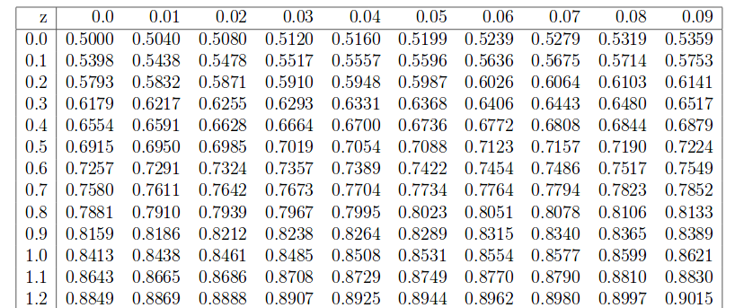

```{r echo=FALSE,results='hide'}
library(knitr)
options(digits=4)
```
# Matemáticas III. Algunos EJERCICIOS para ENTRENAR tipo examen; de los temas de: Probabilidad, Variables Aleatorias y Distribuciones Notables

## Ejercicio 1
Sean $A$ y $B$ dos sucesos tales que $P(A\cap B^c)=P(B\cap A^c)=P(A\cap B)=0.2$  ¿Qué vale $P(A\cup B)$?

### Solución:

Tenemos que  $P(A\cap B^c)=P(A-B)=P(A)-P(A\cap B)=0.2$  y también  $P(B\cap A^c)=P(B-A)=P(B)-P(A\cap B)=0.2$.
 De donde, utilizando que $P(A\cap B)=0.2$ tenemos que $P(A)=P(B)=0.4$. Y ahora calculamos lo que se pide
 $$P(A\cup B)=P(A)+P(B)-P(A\cap B)=0.4+0.4-0.2=0.6.$$

## Ejercicio 2

En una muestra aleatoria simple de tamaño $100$ de la población de internautas  se obtuvo que el 80\% tenían cuenta en al menos dos redes sociales. Calcular el error estándar de la proporción $p$ de internautas que tienen  cuenta el al menos dos redes sociales.

### Solución:

```{r proporcioninternautas,results='hide',echo=FALSE}
phat=0.8
n=100
error.estandar=sqrt(phat*(1-phat)/n)
```

Tenemos una muestra aleatoria simple de tamaño $n=100$ en la que la proporción muestral es $\hat{p}=0.8$. Bajo estas condiciones el error estándar del estadístico $\hat{p}$ es 

$$\sqrt{\frac{\hat{p}\cdot (1- \hat{p})}{n}}=\sqrt{\frac{`r phat`\cdot (`r 1-phat`)}{ n}}=`r error.estandar`.$$


## Ejercicio  3

¿Cuál es la probabilidad de que la suma de  los puntos de  dos dados  de parchís perfectos sea $7$ en los siguientes tres  casos?

a). Tiro un dado dos veces y sumo los resultados.

b). Tiro a la  vez dos dados  blancos y sumo los resultados.

c). Tiro a la vez un  dado rojo y uno azul y sumo los resultados.

### Solución:
```{r sumasdados,results='hide',echo=FALSE}
puntuaciones=1:6
sumas=matrix(0,nrow=6,ncol=6)
for(dado1 in puntuaciones){
  for (dado2 in puntuaciones){
    sumas[dado1,dado2]=as.integer(dado1+dado2)
  }
}
```

 En las tres situaciones a), b) y c) los casos posibles son los siguientes
 pares dónde el primer elemento es el Dado1 (sea del color que sea) y el segundo es el Dado 2 (de cualquier color) $\{(1,6),(2,5),(3,4),(4,3),(5,2),(6,1)\}$.


Así que $P( \mbox{La suma es } 7)=\frac{\mbox{Casos Favorables}}{\mbox{Casos Posibles}}=\frac{6}{36}=\frac{1}{6}$


## Ejercicio 4

Sea $X$ una variable aleatoria que  cuenta el número de \textbf{CARAS} de una moneda trucada una distribución $B(n=100,p=\frac{1}{4})$.  Sabemos que $P(X\leq 40)=0.8962$ ¿Cuál es la probabilidad de obtener  $59$ **CRUCES** o menos? (Indicación construid la variable $Y=100-X$ que cuenta el número de **CRUCES**.)

### Solución:

Sea $Y$ la variable que cuenta el número de cruces en el mismo experimento. Obviamente tenemos que $Y=100-X$. 
Así que 

$$P(Y=59)= P(100-X\leq 59) = P(X\geq 41)= 1-P(X < 41)=1-P(X\leq 40)=1-0.8962=`r 1-0.8962`.$$

## Ejercicio 5 

Si $X$ es una variable aleatoria con distribución $Exp(\lambda)$ y sabemos que $P(X>4)=0.5$ ¿Qué vale $P(X\geq 8/X>4)$?

### Solución:

Sabemos que la distribución exponencial carece de memoria lo que quiere decir que 
$P(X> x+y/X>x)=P(X> y)$. En nuestro caso 

$$P(X>8/X>4)=P(X> 4+4/X>4)=P(X>4)=0.5.$$

## Ejercicio 6 

Cuatro personas con cuatro gorras diferentes las lanzan al aire para celebrar la victoria de su equipo. Cuando caen las recogen al azar. Estudiar la distribución de la variable que nos da  el número de gorras que se quedan con su dueño (**1 punto**).

### Solución:


```{r}
library(combinat)
Casos=as.data.frame(matrix(unlist(permn(1:4)),byrow=TRUE,ncol=4))
names(Casos)=paste("Persona",1:4,sep="")
Casos$Aciertos=unlist(apply(Casos[,1:4],MARGIN=1,FUN=function(x) sum(x==c(1:4))))
Casos
table(Casos$Aciertos)
```

Sea $X=$ número de personas con su propio sombrero, el dominio es $D_X=\{0,1,2,3,4\}$.

Como son equiprobables  y los casos posibles son $4!=24$ tenemos que 

$$P(X=k)=\frac{\mbox{Casos favorables a $k$ aciertos}}{\mbox{Casos posibles}}=\frac{\mbox{Casos favorables a k aciertos}}{24}$$

Contando los casos tenemos que 

```{r tabla1, echo=FALSE}
df=data.frame(Aciertos=c(0,1,2,4),Frecuencia=c(9 , 8 , 6 , 1))
knitr::kable(df)
```


por lo tanto 
$$P(X=k)=\left\{
\begin{array}{lr}
\frac{9}{24} & k=0\\
\frac{8}{24} & k=1\\
\frac{6}{24} & k=2\\
\frac{1}{24} & k=4\\
0 & \mbox{en otro caso}
\end{array}
\right.
$$

Calculemos la esperanza y la varianza

$E(X)= 0\cdot \frac{9}{24} +1\cdot 
\frac{8}{24} + 2 \cdot 
\frac{6}{24} + 4 \cdot
\frac{1}{24} =\frac{8+12+4}{24}=1$


$E(X^2)= 0\cdot \frac{9}{24} +1^2\cdot 
\frac{8}{24} + 2^2 \cdot 
\frac{6}{24} + 4^2 \cdot
\frac{1}{24} =\frac{8+24+16}{24}=2$


$Var(X)=E(X^2)-E(X)^2=2-1^2=1$.

## Ejercicio 7

Diseñamos un examen tipo test de $n=10$ preguntas con $k>2$ opciones cada una de la que sólo una es correcta.
Cada pregunta vale un punto. Supongamos que un estudiante contesta todas las preguntas al azar. Se pide

a). Si cada pregunta vale un punto y cada fallo 0 puntos  ¿Cuál es el valor esperado de la nota del estudiante en función de $k$? (**0.5 puntos**).

b). En función de $k$ ¿cuál es la el valor que tenemos que asignar a cada respuesta incorrecta para que la nota esperada del estudiante que contesta al azar sea $0$? (**0.5 puntos**) 

c).  Puntuando como decidáis en el apartado anterior ¿Cuál es la varianza de la nota de un estudiante que contesta al azar?(**0.5 puntos**)


### Solución:

Sea $X$ el número de preguntas que acierta el estudiante que contesta al azar. Tiene como probabilidad de acertar $p=\frac{1}{4}$. Como contesta al azar y de forma independiente cada pregunta $X$ sigue una distribución $B(n=10,p=\frac{1}{k})$.

La nota es $N=1\cdot X$. Así que el valor esperado es $E(N)=E(X)=n\cdot p=\frac{10}{k}.$

Ahora puntuamos restando $c$ por cada pregunta incorrecta. Entonces la nota es $N=X+c (10-X)=(1-c) X+10\cdot  c$. 
Por lo tanto el valor esperado es 

$$E(N)=E((1-c) X+10\cdot  c)=(1-c) E(X)+10\cdot c=(1-c)\frac{10}{k}+10\cdot c.$$

Así que  el  valor $c$ que hace la esperanza cero debe cumplir

$$0=E(X)=(1-c)\frac{10}{k}+10\cdot c$$ 

de donde  obtenemos que $c=-\frac{1}{k-1}$.

Así que la nota penalizando es $N=\left(1+\frac{1}{k-1}\right) X-\frac{10}{k-1}.$

Ahora nos piden la varianza de la nota cuando penalizamos las respuestas incorrectas

$Var(N)=Var\left(\left(1+\frac{1}{k-1}\right) X-10\cdot\frac{1}{k-1}\right)=\left(1+\frac{1}{k-1}\right)^2 Var(X)=
\left(1+\frac{1}{k-1}\right)^2\cdot 10\cdot \frac{1}{k} \left(1-\frac{1}{k}\right)=\frac{10}{k-1}.$


## Ejercicio 8 

Consideremos la función de densidad de una cierta variable continua $X$

$$f(x)=\left\{
\begin{array}{cr}
-k\cdot x & \mbox{ si } -1<x<0\\
k\cdot x & \mbox{ si }  0<x<1\\
0 & \mbox{ en cualquier otro caso}
\end{array}
\right.
$$

Se pide

a). Calcular $k$. (**0.5 puntos**)

b). Calcular la función de  distribución de $X$. (**0.5 puntos**)

c). Calcular $Var(X)$. (**0.5 puntos**)


### Solución:

Para calcular  utilizaremos que una densidad es positiva y que 
$\int_{-\infty}^{\infty} f(x) dx=1$.

Por lo tanto tenemos que 

$1=\int_{-\infty}^{\infty} f(x) dx=\int_{-1}^{1} f(x) dx=
\int_{-1}^{0} -k \cdot x dx+\int_{0}^{1} k \cdot x dx=
\left[-k\frac{x^2}{2}\right]_{x=-1}^0+\left[k\frac{x^2}{2}\right]_{x=0}^1=
0- \frac{-k}{2}+ \frac{k}{2}-0=k$

Por lo tanto $k=1$

Así que la función de densidad es 
$$f(x)=\left\{
\begin{array}{cr}
|x| & \mbox{ si }  -1<x<1\\
0 & \mbox{ en cualquier otro caso}
\end{array}
\right.
$$
Calculemos su función de distribución


$$F(X)=P(X\leq x)=\left\{
\begin{array}{lr}
0 & \mbox{ si }  x\leq -1\\
\int_{-1}^x |t| dt=\int_{-1}^x -t dt=\left[-\frac{t^2}{2}\right]_{t=-1}^x= \frac{-x^2}{2}-\frac{-1}{2}=\frac{1-x^2}{2}   & \mbox{ si }  -1< x <0\\
\int_{-1}^x |t| dt=\int_{-1}^{0} -t dt +\int_{0}^x t dt=\frac{1}{2}+\left[\frac{t^2}{2}\right]_{t=0}^x= \frac{1}{2}+\frac{x^2}{2}-0=\frac{x^2+1}{2}   & \mbox{ si }  0\leq x\leq 1\\
\qquad 1 & \mbox{si } x \geq 1
\end{array}
\right.
.$$

En definitiva la función de distribución es 

$$
F(X)=P(X\leq x)=\left\{
\begin{array}{lr}
0 & \mbox{ si }  x\leq -1\\
\frac{x^2-1}{2}   & \mbox{ si }  -1< x <0\\
\frac{x^2+1}{2}   & \mbox{ si }  0 \leq x\leq 1\\
1 & \mbox{si } x \geq 1
\end{array}
\right.
.
$$

El valor esperado es 

$$E(X)=\int_{-1}^{0} x\cdot (-x) dx+\int_{0}^{1} x\cdot x dx= \left[-\frac{x^3}{3}\right]_{x=-1}^0+
\left[\frac{x^3}{3}\right]_ {x=0}^1=0.
$$

y la varianza

$$Var(X)=E(X^2)-E(X)^2=\int_{-1}^{0} x^2\cdot (-x) dx+\int_{0}^{1} x^2\cdot x dx-0=
\left[-\frac{x^4}{4}\right]_{x=-1}^0+\left[\frac{x^4}{4}\right]_{x=0}^1=0-\frac{-1}{4}+\frac{1}{4}-0=\frac{1}{2}.$$


## Ejercicio 9

Consideremos la siguiente muestra aleatoria simple de  una cierta variable aleatoria $X$.
$$-3,-2,-1,1,2,3$$
Calculad la desviación típica muestral.(*0.5 puntos*)

### Solución:

La media es $\overline{x}=\frac{\sum_{i=1}^n x_i}{n}=\frac{-3-2-1+1+2+3}{6}=0.$

$\tilde{S}=\sqrt{\frac{n}{n-1}\cdot \left(\frac{\sum_{i=1}^n x_i^2}{n}-\overline{x}^2\right)}=
\sqrt{\frac{6}{6-1}\cdot \left(\frac{(-3)^2+(-2)^2+(-1)^2+(1)^2+(2)^2+(3)^2}{6}-0^2\right)}=
\sqrt{\frac{6}{5}\cdot \frac{28}{6}}=\sqrt{\frac{28}{5}}= `r round(sqrt(28/5),4)`.$
 
Con R obtenemos el mismo resultado 

```{r}
x=c(-3,-2,-1,1,2,3)
n=length(x)
n
sqrt((sum(x^2)/n-(sum(x)/n)^2) *(n/(n-1)))
sd(x)
```

##  Ejercicio 10 

Si $A$, $B$ y $C$ son tres sucesos tales que  $P(A/C)= 0.3$,  $P(B/C)=0.8$ y que $P((A\cap B)/C)=0.1$. Calculad $P((A-B)/C)$.(*0.5 puntos*)

### Solución:

La probabilidad pedida es $P((A-B)/C)=$P(A/C)-$P(A\cap B/C)=0.3-0.1=0.2.$

## Ejercicio 11

Consideremos una muestra aleatoria simple  de tamaño $n=100$ de una variable aleatoria $X$ Bernoulli de parámetro $p$.
¿Cuál es el valor  esperado y el error estándar de la media aritmética de la muestra? (*0.5 puntos*)

### Solución

El valor esperado es $E(\overline{X}) =E(X)= 100\cdot p$  y el error estándar $\sigma_{\overline{X}} =\sigma_{X}=\sqrt{\frac{p\cdot(1-p)}{100}}.$

## Ejercicio 12  

Consideremos  una v.a. $X$ normal de media $\mu=20$ y $\sigma=50$. Tomamos una muestra aleatoria simple de tamaño $n=100$. Calculad
$P(20< \overline{X}<25 /\overline{X}>20)$ (*0.5 puntos*)





### Solución:
$\begin{aligned}
P(20< \overline{X}<25 /\overline{X}>20)&=\frac{P(20< \overline{X}<25\cap \overline{X}>20)}{1-P( \overline{X}\leq 20))}\\
&=\frac{F_Z\left(\frac{25-20}{\frac{50}{\sqrt{100}}}\right)-F_Z\left(\frac{20-20}{\frac{50}{\sqrt{100}}}\right)}{1-F_Z\left(\frac{20-20}{\frac{50}{\sqrt{100}}}\right)}=
\frac{F_Z(1)-F_Z(0)}{F_Z(0)}.
\end{aligned}$

## Ejercicio 13

Lanzamos un dado de 12 caras numeradas  con enteros del 1 al 12 sobre una mesa plana. Observamos el número superior del dado. Suponiendo equiprobabilidad de todas las caras calcular la probabilidad de que salga mayor que 8  si el resultado es par. (*1 punto*)

### Solución:

$$ P(X>8/X\in\{2,4,6,8,10,12\})=\frac{P(X\in\{10,12\})}{P(X\in\{2,4,6,8,10,12\})}=\frac{2/12}{6/12}=\frac{1}{3}.$$

## Ejercicio 14

Lanzamos una moneda con probabilidad de cara $p=\frac{1}{2}$ hasta que sale cara dos veces  o bien la hemos lanzamos 5 veces, lo primero que ocurra.

Denotemos por $X$ la variable aleatoria que determina el número de tiradas de la moneda.

Se pide: 

a). Describid adecuadamente el espacio muestral de la variable $X$. (**0.5 puntos**)

b). Calcular  su función de densidad. (**1 punto**)

c). Calcular $E(X)$. (**0.5 puntos**)

### Solución:
De notemos los sucesos elementales por $C$= cara $+$=cruz así el espacio muestral es 

$$\begin{aligned}\Omega=\{&CC,C+C,+CC,++CC,+C+C,C++C,+++CC,++C+C,+C++C,C+++C,\\ & +++++,C++++,+C+++,++C++,+++C+,++++C\}\end{aligned}.$$

Si $X=$  es l número de tiradas  su dominio queda determinado por $D_X=\{2,3,4,5\}.$

Calculemos los valores de su función de probabilidad

$P(X=2)=\left(\frac{1}{2}\right)^2, P(X=3)=2\cdot\left(\frac{1}{2}\right)^3,P(X=4)=3\cdot\left(\frac{1}{2}\right)^4,P(X=5)=10\cdot \left(\frac{1}{2}\right)^5.$

$$f_x(x)=P(X=x)= \left\{\begin{array}{ll} 
(x-1)\cdot \left(\frac{1}{2}\right)^x & \mbox{ si } x=2,3,4\\
\frac{10}{32}& \mbox{ si } x=5\\
0 & \mbox{ en el resto de casos.}
\end{array}
\right.
$$

$E(X)=2\cdot\frac{1}{4}+3\cdot \frac{1}{4}+ 4\cdot \frac{3}{16}+5\cdot \frac{10}{32}=\frac{57}{16}.$


## Ejercicio 15

Sea $X$  una variable  con distribución uniforme en el intervalo $(1,10)$ con  $a>1$. Consideremos la variable $Y=\log_{10}(X)$. Se pide

a). Calcular la función de distribución  de $Y$ (**1 punto**)
b). Calcular la función de densidad de $Y$. (**0.5 puntos**)
c). Calcular el cuantil 0.95 de $Y$es decir un valor $y_0$ tal que $P(Y\leq y_0)=0.95$. (**0.5 puntos**)

### Solución:

Recordemos que 
$$
F_X(x)=\left\{
\begin{array}{ll} 
0 & \mbox{si} x\leq 0\\
\frac{x-1}{9} & \mbox{si} 0< x < 10\\
1 & \mbox{si} x\geq 10
\end{array}\right.
$$

La variable $Y$ tendrá por dominio $D_Y=(0,1)$.

Sea $y\in(0,1)$ entonces $F_Y(y)=P(Y\leq y)=P(\log(X)\leq y)=P(X\leq 10^y)=\frac{10^y-1}{9}$ ya que  como $0<y<1$ entonces
$0< 10^y < 10$.  Así que la función de distribución es 

$$
F_Y(y)=\left\{\begin{array}{ll} 
0 & \mbox{si} x\leq 0\\
\frac{10^y-1}{9} & \mbox{si} 0< y < 1\\
1 & \mbox{si} y\geq 1\\
\end{array}\right.
$$

 su densidad es 


$$
f_y(y)=F'_Y(y)=\left\{\begin{array}{ll} 
\frac{10^y\cdot log_e(10)}{9} & \mbox{si} 0< y < 1\\
0 & \mbox{en cualquier otro caso}\\
\end{array}\right.
$$


El cuantil $0.95$ es el valor $y_0$ tal que $F_y(y_0)=P(Y\leq y_0)=0.95$. Por lo tanto 

$$F_y(y_0)=\frac{10^{y_0}-1}{9}=0.95$$

así que $10^{y_0}=9\cdot 0.95+1=`r 9*0.95+1`$, de donde $y_0=\log_{10}(`r 9*0.95+1`)=`r log10(9*0.95+1)`.$


## Ejercicio 16

Sea $X$ una v.a. discreta de dominio $D_X=\{-2,-1,0,1,2\}$. Sabemos que $P(X=x)=p$ para $x\in D_X$. Calculad $Var(X)$. (**0.5 puntos**)

### Solución:

Obviamente $p=\frac{1}{5}.$

$Var(X)=E(X^2)-E(X)^2=\displaystyle\sum_{x=-2}^{2} x^2\cdot P(X=x)-\left(\displaystyle\sum_{x=-2}^2 x\cdot P(X=x)\right)^2=
(-2)^2\cdot p+(-1)^2\cdot p+0^2\cdot p+1^2\cdot p+(-2)^2\cdot p-\left(-2\cdot p -1\cdot p+0\cdot p+1\cdot p +2\cdot p\right)^2=
10\cdot p+0^2=10\cdot p=10\cdot \frac{1}{5}=2.$

## Ejercicio 17
Sea $Z$ una variable aleatoria normal estándar.  Tenemos que `pnorm(-0.2)=`r  pnorm(-0.2)`. Calculad $P(|Z|\geq 0.2)$. (**0.5 puntos**) 

### Solución:
Por simetŕia de la normal estándar sabemos que 
$P(Z>0.2)=p(Z<-0.2)$ por lo tanto 

$$P(|Z|\geq 0.2)=P(Z>0.2)+p(Z<-0.2)=2\cdot P(Z<-0.2)=2\cdot `r  pnorm(-0.2)`=
`r  2*pnorm(-0.2)`.$$

Con  R

```{r}
2*pnorm(-0.2)
```

## Ejercicio 18
 **(3 puntos)**
Consideremos la v.a. $X$ con función densidad

$$f(x)=\left\{
\begin{array}{cl}
 \displaystyle 0.5& \mbox{si } 0< x <1 \\
\displaystyle\frac{x-1}{2} & \mbox{si } 1\leq x < a \\
 \displaystyle 0 & \mbox{ en cualquier otro caso } \\
\end{array}\right..
$$

a). Calculad el valor de $a$ para que $f$ sea función de densidad.

b). Para el anterior valor de $a$ calculad la función de distribución de $X$.

c). Para el anterior valor de $a$ calculad $E(X)$.

d). Para el anterior valor de $a$ calculad $Var(X)$.


### Solución

Concurso redactar y subir al foro ¡¡¡décimas extra.!!!


